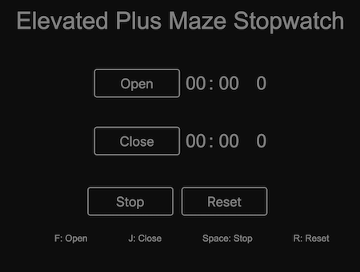

# Elevated Plus Maze Stopwatch

- **Created for the Neurobiology of Memory lab at the University of Texas at Dallas for neural engineering and studies on PTSD**

* **An optimized timer for scoring results on an elevated plus maze. Use the buttons or keys to control timers.**

## Preview:

## Live Site:

- [Elevated Plus Maze Stopwatch](https://epms.netlify.app/)

## Dependencies

- Made with HTML, CSS, and JavaScript
